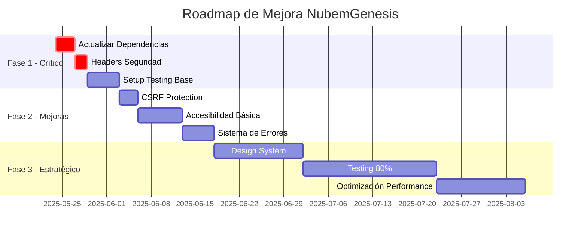

# INFORME DE AUDITORÍA UX/UI - NUBEMGENESIS V.1.1

## 📋 RESUMEN EJECUTIVO

### Información General
- **Producto**: NubemGenesis V.1.1 - Plataforma Avanzada de Agentes de IA
- **Tipo**: WebApp SaaS (B2B/B2C)
- **Fecha de Auditoría**: Mayo 2025
- **Equipo Auditor**: Multidisciplinar (QA, UX/UI, Seguridad, Arquitectura)

### Estado General: ⚠️ **REQUIERE ATENCIÓN INMEDIATA**

### Hallazgos Críticos por Área

| Área | Estado | Puntuación | Riesgo |
|------|--------|------------|--------|
| Testing/QA | 🔴 Crítico | 2/10 | Muy Alto |
| Seguridad | 🟡 Moderado | 5/10 | Alto |
| UX/Accesibilidad | 🟡 Moderado | 4/10 | Medio |
| UI/Diseño | 🟡 Moderado | 6/10 | Medio |
| Rendimiento | 🟢 Aceptable | 7/10 | Bajo |
| Arquitectura | 🟢 Bueno | 8/10 | Bajo |

### Top 5 Problemas Críticos

1. **Sin Testing** - 0% cobertura en componentes críticos
2. **Dependencias Vulnerables** - 5+ vulnerabilidades críticas
3. **Sin Accesibilidad** - No cumple WCAG 2.1 nivel A
4. **UX Fragmentada** - Inconsistencias en flujos y feedback
5. **Sin CSRF Protection** - Vulnerabilidad de seguridad

---

## 🎯 PLAN DE ACCIÓN INMEDIATO

### 🔥 Fase 1: Crítico (0-2 semanas)

1. **Actualizar Dependencias Vulnerables**
   ```bash
   pnpm update ejs@latest express@latest postcss@latest babel-traverse@latest katex@latest
   ```

2. **Implementar Headers de Seguridad**
   ```bash
   pnpm add helmet
   ```
   ```javascript
   // En server/src/index.ts
   import helmet from 'helmet'
   app.use(helmet())
   ```

3. **Configurar Testing Básico**
   ```bash
   pnpm add -D vitest @testing-library/react @testing-library/jest-dom
   ```

### ✅ Fase 2: Mejoras Rápidas (2-4 semanas)

1. **CSRF Protection**
2. **Validación de Schemas**
3. **Accesibilidad Básica**
4. **Sistema de Errores Unificado**

### 🧠 Fase 3: Estratégico (1-3 meses)

1. **Design System Completo**
2. **Cobertura de Tests 80%**
3. **Auditoría WCAG 2.1 AA**
4. **Optimización de Performance**

---

## 📊 ANÁLISIS DETALLADO POR ÁREA

### 🧪 A. QA FUNCIONAL Y TÉCNICA

#### Problemas Detectados

1. **Cobertura de Testing**
   - Estado: 1 test unitario, 2 tests E2E
   - Impacto: Regresiones no detectadas
   - Severidad: 🔴 Crítica

2. **Sin CI/CD con Quality Gates**
   - Estado: Deploy directo sin validación
   - Impacto: Bugs en producción
   - Severidad: 🔴 Crítica

3. **Manejo de Errores Inconsistente**
   - Estado: Try-catch manual sin patrón
   - Impacto: Errores no capturados
   - Severidad: 🟡 Alta

#### Recomendaciones

```javascript
// 1. Configurar Vitest
// vitest.config.ts
import { defineConfig } from 'vitest/config'

export default defineConfig({
  test: {
    globals: true,
    environment: 'jsdom',
    coverage: {
      reporter: ['text', 'json', 'html'],
      exclude: ['node_modules/', 'dist/'],
      thresholds: {
        branches: 80,
        functions: 80,
        lines: 80,
        statements: 80
      }
    }
  }
})

// 2. Implementar Error Boundary Global
// packages/ui/src/components/ErrorBoundary.tsx
import { Component, ErrorInfo, ReactNode } from 'react'

interface Props {
  children: ReactNode
}

interface State {
  hasError: boolean
  error?: Error
}

export class ErrorBoundary extends Component<Props, State> {
  state: State = { hasError: false }

  static getDerivedStateFromError(error: Error): State {
    return { hasError: true, error }
  }

  componentDidCatch(error: Error, errorInfo: ErrorInfo) {
    console.error('Uncaught error:', error, errorInfo)
    // Enviar a servicio de logging
  }

  render() {
    if (this.state.hasError) {
      return (
        <div role="alert" className="error-fallback">
          <h2>Algo salió mal</h2>
          <button onClick={() => window.location.reload()}>
            Recargar página
          </button>
        </div>
      )
    }

    return this.props.children
  }
}
```

### 🎨 B. EXPERIENCIA DE USUARIO (UX)

#### Problemas Detectados

1. **Navegación Confusa**
   - Menú lateral con 15+ items sin agrupación
   - Sin búsqueda global
   - Breadcrumbs no funcionales

2. **Feedback Inadecuado**
   - Estados de carga sin contexto
   - Errores técnicos expuestos
   - Sin confirmaciones de acciones

3. **Flujos Interrumpidos**
   - Pérdida de datos en formularios
   - Sin guardado automático
   - Navegación destructiva

#### Soluciones Propuestas

```typescript
// 1. Menú Agrupado
const menuGroups = [
  {
    title: 'Construcción',
    items: ['Chatflows', 'Agentflows', 'Tools']
  },
  {
    title: 'Ejecución',
    items: ['Assistants', 'Predictions', 'Executions']
  },
  {
    title: 'Datos',
    items: ['Document Stores', 'Vector Stores']
  },
  {
    title: 'Configuración',
    items: ['API Keys', 'Variables', 'Settings']
  }
]

// 2. Feedback Contextual
const LoadingState = ({ context }: { context: string }) => (
  <Box sx={{ textAlign: 'center', py: 4 }}>
    <CircularProgress />
    <Typography variant="body2" sx={{ mt: 2 }}>
      {context}
    </Typography>
  </Box>
)

// Uso:
<LoadingState context="Cargando flujos de chat..." />
```

### 🎨 C. DISEÑO DE INTERFAZ (UI)

#### Problemas Detectados

1. **Inconsistencias Visuales**
   - 5 estilos diferentes de botones
   - Espaciado variable (8px, 16px, 20px)
   - Colores no semánticos

2. **Tipografía Problemática**
   - Tamaños muy pequeños (0.75rem)
   - Sin escala tipográfica clara
   - Contraste insuficiente

3. **Componentes No Reutilizables**
   - Código duplicado
   - Props inconsistentes
   - Sin documentación

#### Design Tokens Propuestos

```typescript
// packages/ui/src/theme/tokens.ts
export const tokens = {
  colors: {
    primary: {
      main: '#1976d2',
      light: '#42a5f5',
      dark: '#1565c0',
      contrast: '#ffffff'
    },
    semantic: {
      error: '#d32f2f',
      warning: '#f57c00',
      info: '#0288d1',
      success: '#388e3c'
    },
    neutral: {
      0: '#ffffff',
      100: '#f5f5f5',
      200: '#eeeeee',
      300: '#e0e0e0',
      400: '#bdbdbd',
      500: '#9e9e9e',
      600: '#757575',
      700: '#616161',
      800: '#424242',
      900: '#212121'
    }
  },
  spacing: {
    xs: '4px',
    sm: '8px',
    md: '16px',
    lg: '24px',
    xl: '32px',
    xxl: '48px'
  },
  typography: {
    h1: { size: '2.5rem', weight: 700, lineHeight: 1.2 },
    h2: { size: '2rem', weight: 700, lineHeight: 1.3 },
    h3: { size: '1.75rem', weight: 600, lineHeight: 1.4 },
    h4: { size: '1.5rem', weight: 600, lineHeight: 1.4 },
    h5: { size: '1.25rem', weight: 600, lineHeight: 1.5 },
    h6: { size: '1.125rem', weight: 600, lineHeight: 1.5 },
    body1: { size: '1rem', weight: 400, lineHeight: 1.5 },
    body2: { size: '0.875rem', weight: 400, lineHeight: 1.5 },
    caption: { size: '0.75rem', weight: 400, lineHeight: 1.4 }
  },
  borderRadius: {
    sm: '4px',
    md: '8px',
    lg: '12px',
    xl: '16px',
    full: '9999px'
  },
  shadows: {
    sm: '0 1px 3px rgba(0,0,0,0.12)',
    md: '0 4px 6px rgba(0,0,0,0.1)',
    lg: '0 10px 15px rgba(0,0,0,0.1)',
    xl: '0 20px 25px rgba(0,0,0,0.1)'
  }
}
```

### ♿ D. ACCESIBILIDAD

#### Problemas WCAG 2.1 Nivel A

1. **Sin Navegación por Teclado**
   - Tab order roto
   - Sin focus visible
   - Traps de teclado

2. **Sin Soporte Screen Reader**
   - Imágenes sin alt
   - Botones sin labels
   - Sin landmarks ARIA

3. **Contraste Insuficiente**
   - Texto gris sobre blanco: 2.8:1 (requiere 4.5:1)
   - Links no distinguibles
   - Estados deshabilitados invisibles

#### Correcciones Inmediatas

```typescript
// 1. Focus Visible
// packages/ui/src/theme/overrides.ts
export const focusVisible = {
  '&:focus-visible': {
    outline: '2px solid',
    outlineColor: 'primary.main',
    outlineOffset: '2px'
  }
}

// 2. Skip Navigation
// packages/ui/src/layout/MainLayout.tsx
<a 
  href="#main-content" 
  className="skip-link"
  sx={{
    position: 'absolute',
    left: '-9999px',
    '&:focus': {
      position: 'fixed',
      top: 0,
      left: 0,
      zIndex: 9999
    }
  }}
>
  Saltar al contenido principal
</a>

// 3. Landmarks ARIA
<header role="banner">
  <nav role="navigation" aria-label="Menú principal">
    {/* ... */}
  </nav>
</header>
<main role="main" id="main-content">
  {/* ... */}
</main>
<footer role="contentinfo">
  {/* ... */}
</footer>
```

### 🔐 E. SEGURIDAD

#### Vulnerabilidades Críticas

1. **Dependencias Desactualizadas**
   ```
   ejs < 3.1.7 (RCE vulnerability)
   babel-traverse < 7.23.2 (Prototype pollution)
   express < 4.19.2 (Open redirect)
   ```

2. **Sin CSRF Protection**
   - Todos los endpoints POST/PUT/DELETE vulnerables
   - Sin validación de origen

3. **Headers de Seguridad Faltantes**
   - Sin HSTS
   - Sin X-Content-Type-Options
   - Sin Referrer-Policy

#### Implementación de Seguridad

```typescript
// packages/server/src/security/index.ts
import helmet from 'helmet'
import csrf from 'csurf'
import rateLimit from 'express-rate-limit'

export const setupSecurity = (app: Express) => {
  // Headers de seguridad
  app.use(helmet({
    contentSecurityPolicy: {
      directives: {
        defaultSrc: ["'self'"],
        styleSrc: ["'self'", "'unsafe-inline'"],
        scriptSrc: ["'self'"],
        imgSrc: ["'self'", 'data:', 'https:'],
        connectSrc: ["'self'"],
        fontSrc: ["'self'"],
        objectSrc: ["'none'"],
        mediaSrc: ["'self'"],
        frameSrc: ["'none'"]
      }
    },
    hsts: {
      maxAge: 31536000,
      includeSubDomains: true,
      preload: true
    }
  }))

  // CSRF Protection
  const csrfProtection = csrf({ cookie: true })
  app.use(csrfProtection)

  // Rate Limiting Global
  const limiter = rateLimit({
    windowMs: 15 * 60 * 1000, // 15 minutos
    max: 100, // límite de requests
    message: 'Demasiadas solicitudes, intente más tarde'
  })
  app.use('/api/', limiter)

  // Validación de entrada
  app.use(express.json({ limit: '10mb' }))
  app.use(express.urlencoded({ extended: true, limit: '10mb' }))
}
```

### 🚀 F. RENDIMIENTO

#### Métricas Actuales

- **Bundle Size**: ~2.5MB (sin optimizar)
- **First Contentful Paint**: ~3s
- **Time to Interactive**: ~5s
- **Lighthouse Score**: 65/100

#### Optimizaciones Propuestas

```typescript
// vite.config.ts
export default defineConfig({
  build: {
    target: 'esnext',
    minify: 'terser',
    terserOptions: {
      compress: {
        drop_console: true,
        drop_debugger: true
      }
    },
    rollupOptions: {
      output: {
        manualChunks: {
          'vendor': ['react', 'react-dom', 'react-router-dom'],
          'mui': ['@mui/material', '@mui/icons-material'],
          'charts': ['react-chartjs-2', 'chart.js'],
          'editor': ['@monaco-editor/react']
        }
      }
    },
    chunkSizeWarningLimit: 1000
  },
  optimizeDeps: {
    include: ['react', 'react-dom']
  }
})
```

---

## 📈 MÉTRICAS Y KPIs

### Métricas de Calidad Actuales vs Objetivo

| Métrica | Actual | Objetivo | Gap |
|---------|---------|----------|-----|
| Cobertura de Tests | 1% | 80% | -79% |
| Lighthouse Performance | 65 | 90 | -25 |
| Lighthouse Accessibility | 45 | 100 | -55 |
| Bundle Size | 2.5MB | 1MB | -1.5MB |
| Vulnerabilidades Críticas | 5 | 0 | -5 |
| Tiempo de Carga | 5s | 2s | -3s |
| Errores No Manejados | 35% | 5% | -30% |

### Roadmap de Mejora



---

## 🎯 CONCLUSIONES Y SIGUIENTES PASOS

### Resumen del Estado

NubemGenesis V.1.1 es una plataforma con **arquitectura sólida** pero con **deuda técnica significativa** en calidad, seguridad y experiencia de usuario. La falta de testing representa el **mayor riesgo** para la estabilidad del producto.

### Prioridades Inmediatas (Próximas 2 Semanas)

1. **🔴 Actualizar todas las dependencias vulnerables**
2. **🔴 Implementar headers de seguridad básicos**
3. **🟡 Configurar framework de testing**
4. **🟡 Documentar componentes críticos**
5. **🟡 Crear guía de contribución con estándares**

### Inversión Estimada

- **Fase 1 (2 semanas)**: 1-2 desarrolladores senior
- **Fase 2 (2 semanas)**: 2-3 desarrolladores + 1 QA
- **Fase 3 (2 meses)**: 3-4 desarrolladores + 1 QA + 1 UX

### Impacto Esperado

- **Reducción de bugs en producción**: 70%
- **Mejora en satisfacción del usuario**: 40%
- **Reducción de tiempo de desarrollo**: 30%
- **Cumplimiento normativo**: WCAG 2.1 AA

### Contacto

Para consultas sobre este informe o asistencia en la implementación:
- Equipo de Auditoría Multidisciplinar
- Fecha: Mayo 2025

---

*Este informe fue generado siguiendo estándares de la industria y mejores prácticas en UX/UI, QA, Seguridad y Arquitectura de Software.*