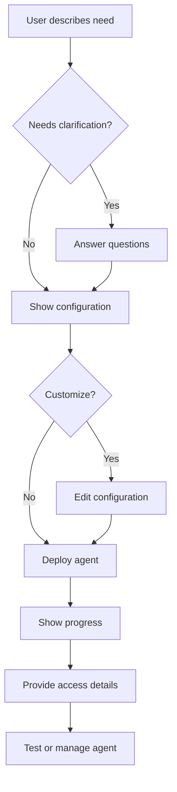

# Agent Creator Frontend Implementation

## Overview

The Agent Creator is a natural language interface for creating AI agents in NubemGenesis. It provides a conversational, wizard-like experience that guides users through the process of describing their needs and deploying a fully configured agent.

## Features

### 1. Natural Language Input
- Users describe what they need in plain language
- Real-time suggestions based on similar use cases
- Popular examples to inspire users

### 2. Intelligent Clarification
- Dynamic questions generated based on user input
- Smart defaults and recommendations
- Optional advanced settings for power users

### 3. Visual Configuration Preview
- Clear display of agent capabilities
- Real-time cost estimation
- Ability to customize before deployment

### 4. Live Deployment Progress
- Real-time deployment status
- Detailed logs for transparency
- Visual progress indicators

### 5. Immediate Access
- API credentials generated automatically
- Quick start code examples
- Direct links to test and manage the agent

## Architecture

```
agentcreator/
├── index.jsx                    # Main container
├── AgentCreatorDialog.jsx       # Modal orchestrator
├── steps/                       # Wizard steps
│   ├── DescribeNeedStep.jsx    # Natural language input
│   ├── ClarificationStep.jsx   # Dynamic questions
│   ├── ConfigurationStep.jsx   # Preview & customize
│   ├── DeploymentStep.jsx      # Live deployment
│   └── AccessStep.jsx          # Credentials & guides
├── hooks/                       # Business logic
│   ├── useOrchestration.js     # API orchestration
│   └── useDeployment.js        # Deployment management
└── README.md                    # This file
```

## User Flow



## Integration Points

### Frontend Routes
- `/agent-creator` - Main agent creator page
- `/chatbot/:id` - Test deployed agent
- `/canvas/:id` - Manage agent configuration

### API Endpoints
- `POST /api/v2/orchestrate/analyze` - Analyze user description
- `POST /api/v2/orchestrate/generate` - Generate agent configuration
- `POST /api/v2/orchestrate/deploy/:id` - Deploy agent (EventSource)
- `GET /api/v2/orchestrate/suggestions` - Get similar use cases

### State Management
- Local component state for wizard flow
- Redux for notifications and navigation
- EventSource for real-time deployment updates

## Component Details

### DescribeNeedStep
- Multi-line text input with placeholder examples
- Real-time suggestions fetched as user types (debounced)
- Popular use case examples with tags
- Tips for better results

### ClarificationStep
- Dynamic questions based on analysis
- Support for radio, checkbox, and text inputs
- Required/optional indicators
- Popular and recommended badges
- Advanced options in accordion

### ConfigurationStep
- Agent preview card with avatar
- Capability chips
- Key metrics (model, cost, performance, security)
- Technical details expandable section
- Edit mode for customization
- Raw JSON viewer

### DeploymentStep
- Progress bar with percentage
- Step-by-step deployment visualization
- Real-time logs with timestamps
- Error handling and recovery
- Collapsible log viewer

### AccessStep
- Success celebration UI
- API endpoint and key display
- Toggle visibility for sensitive data
- Copy to clipboard functionality
- Quick start code examples (cURL, Python, JS)
- Next steps guidance

## Styling & UX

### Design Principles
1. **Progressive Disclosure** - Show complexity only when needed
2. **Visual Feedback** - Always show what's happening
3. **Error Prevention** - Validate inputs before submission
4. **Accessibility** - ARIA labels, keyboard navigation
5. **Responsive** - Works on all screen sizes

### Theme Integration
- Uses MUI theme variables
- Supports dark/light modes
- Consistent with NubemGenesis branding
- Custom animations for transitions

## Error Handling

### User Input Errors
- Inline validation messages
- Helpful error descriptions
- Suggestions for correction

### API Errors
- Graceful fallbacks
- Retry mechanisms
- Clear error messages
- Support contact options

### Deployment Failures
- Detailed error logs
- Recovery suggestions
- Rollback options
- Support escalation

## Performance Optimizations

### Code Splitting
- Lazy load step components
- Dynamic imports for heavy dependencies

### API Optimization
- Debounced suggestion queries
- Cancelled requests on navigation
- Caching for repeated queries

### Rendering
- Memoized components
- Virtual scrolling for logs
- Optimistic UI updates

## Testing Considerations

### Unit Tests
```javascript
// Example test for DescribeNeedStep
describe('DescribeNeedStep', () => {
  it('should enable continue button when input is valid', () => {
    // Test implementation
  })
  
  it('should show suggestions after typing', () => {
    // Test implementation
  })
})
```

### Integration Tests
- Test wizard flow completion
- API mock responses
- Error scenarios
- Edge cases

### E2E Tests
- Complete agent creation flow
- Deployment verification
- Access credential validation

## Future Enhancements

### Planned Features
1. **Templates Library** - Pre-built agent templates
2. **Collaboration** - Share agents with team
3. **Version Control** - Track agent changes
4. **A/B Testing** - Compare agent performance
5. **Analytics Dashboard** - Usage insights

### Technical Improvements
1. **WebSocket Updates** - Real-time collaboration
2. **Offline Support** - PWA capabilities
3. **Batch Operations** - Create multiple agents
4. **Import/Export** - Agent configurations
5. **Webhooks** - Deployment notifications

## Usage Example

```javascript
// To add the agent creator to your app
import AgentCreator from '@/views/agentcreator'

// In your routes
{
  path: '/agent-creator',
  element: <AgentCreator />
}

// To open the dialog programmatically
import AgentCreatorDialog from '@/views/agentcreator/AgentCreatorDialog'

const [dialogOpen, setDialogOpen] = useState(false)

<AgentCreatorDialog
  open={dialogOpen}
  onClose={() => setDialogOpen(false)}
  onAgentCreated={(agent) => {
    console.log('Agent created:', agent)
  }}
/>
```

## Contributing

When adding new features:
1. Follow the existing component structure
2. Add proper TypeScript/PropTypes
3. Include unit tests
4. Update this documentation
5. Test on mobile devices

## Support

For questions or issues:
- Check the console for detailed error logs
- Review the deployment logs in the UI
- Contact support with the agent ID
- Join our Discord community